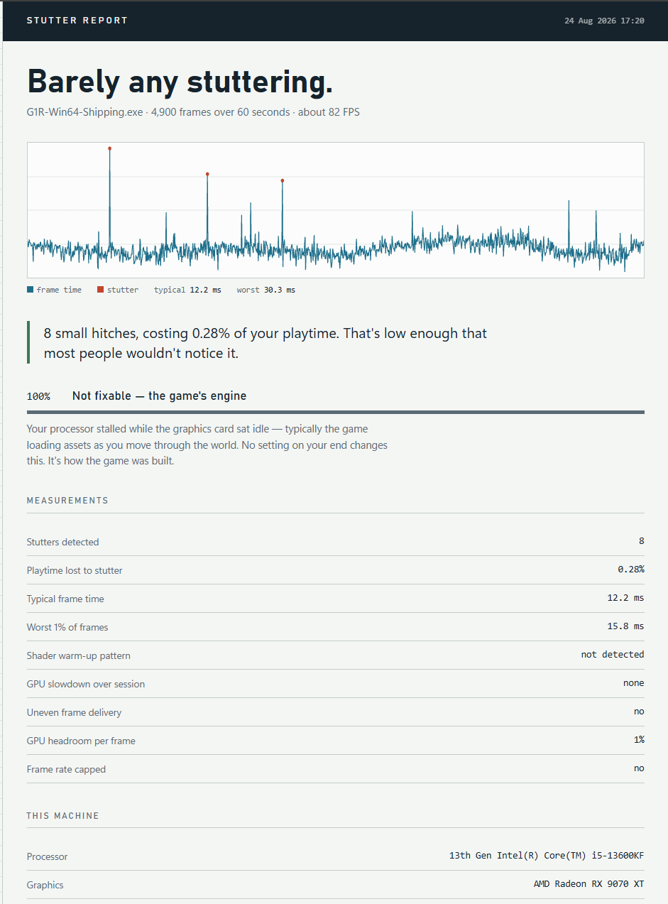

# Stutter Test

Tells you **why** your PC game stutters — and whether it's going to stop.

### [→ Download it here](https://github.com/jkoens3/stutter-test/releases/latest)

Grab all four files into one folder, then run `StutterTest.exe`.

---

Frametime graphs show you *that* you stuttered. They don't tell you what to do
about it. This classifies the cause and gives you a straight answer.



## What it tells you

- **Temporary** — your GPU is compiling shaders the first time it meets new
  effects, then caching them. This will stop, usually within about 30 minutes
  of play. The game isn't broken and neither is your PC.
- **Fixable** — frame pacing, thermal throttling, or display sync problems,
  with the specific thing to change.
- **Not fixable** — the game's engine stalling while it streams assets. No
  setting on your end changes this. It's how the game was built.
- **Can't tell** — the test couldn't work. If your frame rate is capped and
  your GPU is idle part of every frame, stutter physically can't show up, so a
  clean result would be meaningless. It says so instead of pretending you're fine.

## Compare mode — the part that actually proves it

From a **single** recording, this tool is *guessing* that your stutter is
shader compilation. It infers it from a decay pattern — hitches clustered
early in the session, falling off as you play. That's a heuristic and it can
be wrong. Two people pointed this out and they were right.

**Two recordings can prove it**, because the two causes behave differently on
a repeat run:

| | Shader compilation | Asset streaming |
|---|---|---|
| First time through | stutters | stutters |
| Second time, same route | **gone** — it's cached now | **still there** — happens every time |

So: record, play the same stretch again, record again, hit **Compare two runs**.
Whatever disappeared was a one-time cost. Whatever came back is the game.

It also works for **settings changes**. Record, change one thing, record again,
and find out whether that change actually did anything instead of guessing.
Most performance advice is untested folklore; this is how you check it against
your own machine.

## How to use it

1. Download all four files — `StutterTest.exe`, `PresentMon.exe`,
   `report_template.html`, `compare_template.html` — from the
   [latest release](https://github.com/jkoens3/stutter-test/releases/latest)
   into one folder
2. Start your game and get into actual gameplay
3. Run `StutterTest.exe`. On a new release you'll see a **Windows SmartScreen**
   prompt ("Windows protected your PC") — that's reputation, not detection: a
   fresh build has no download history yet, so SmartScreen warns until enough
   people have run it. The file is code signed, so the prompt shows **Jarret
   Koens** as the publisher, not "Unknown publisher". Click **More info → Run
   anyway**, then say yes to the administrator-rights prompt.
4. Click **Find my game**, then **Record**
5. Alt-Tab back into the game and play for a minute — keep moving, go into new
   areas, that's where stutter lives
6. Read the verdict, or click **Open full report** for the detail
7. For a real answer rather than an inference, walk the same stretch again,
   record a second time, and hit **Compare two runs**

## Is this safe?

Reasonable question for any executable that asks for administrator rights.

- **It's code signed** through Microsoft Artifact Signing, so Windows shows a
  verified publisher rather than an unknown one.
- **VirusTotal: 1 of 71.** A single heuristic flag from one scanner. Microsoft
  Defender, Kaspersky, BitDefender, ESET, Sophos, Symantec, Malwarebytes,
  CrowdStrike, Avast and TrendMicro are all clean. (Before signing it was 5 of
  69 — signing cleared four of them, including Defender.)
- **The `detect-debug-environment` tag** on VirusTotal is the .NET runtime
  checking for an attached debugger at startup, which every .NET application
  does. It isn't in my code — search the source for it.
- **Why admin:** reading Windows performance traces requires elevation. That's
  the only reason. Same requirement as PresentMon itself, or FPS Monitor.
- **No overlay, no injection.** Nothing is loaded into the game process. It
  reads trace events the OS already produces. That's also why anti-cheat
  doesn't object — tested against Easy Anti-Cheat.
- **It asks before sending anything.** As of v1.3 there is one network call,
  and it only happens if you click "Send it" on the prompt after a recording.
  See [Sharing results](#sharing-results-opt-in) below — it shows you the exact
  payload before you decide, and "Never ask again" is one click.
- **Nothing is changed.** It doesn't touch your settings, drivers, registry, or
  game files. It only reads.

Full source is in this repo. If you'd rather not run my binary, `BUILD.bat`
compiles it with the C# compiler already included in Windows. Takes about ten
seconds and you never have to trust me.

You may still see a SmartScreen warning. That's reputation, not detection —
signed files still need download history before Windows stops asking.

## Sharing results (opt-in)

**Version 1.3 added a network call. Here is exactly what it does.**

I'm short of captures from PCs that actually stutter. Mine runs everything
fine, so almost every test I have comes back "nothing wrong here" — correct,
and useless for working out where the tool gets things wrong.

So after a recording, the app asks whether you'd share the result. It's **off
until you say yes**, and it shows you the complete payload before you decide.
Not a description of it — the actual text.

**What gets sent:**

```
tool version, game exe name, CPU model, GPU model,
frame count, duration, median frame time, 99th percentile,
stutter count, % of playtime lost, GPU headroom, frame capped y/n,
which patterns were detected, ms lost per cause,
random install ID
```

**What does not get sent:** file paths, your Windows username, your machine
name, your IP beyond what any HTTP request reveals, anything about what you
were doing in the game, or the capture file itself.

**The install ID** is random, generated on your machine, and stored in
`share-settings.txt` next to the exe. It exists so that ten captures from one
person don't get counted as ten people. Delete that file and you get a new one.

**Your options** are Send it / Not this time / Never ask again. "Never ask
again" is permanent. You can also edit `share-settings.txt` directly, or set
`mode=never` before you ever run it.

**To verify all of this:** it's in `Share.cs`. The payload is built in
`BuildPayload()` and there is no other network call anywhere in the
application. If you'd rather not have the capability at all, set `Endpoint`
to an empty string and rebuild — the prompt then never appears.

## Built with AI assistance

I'm not a C# developer. The code was written with AI, and I'd rather say that
up front than have it come up later.

What I did was test it against real captures until it stopped being wrong.
Most of what's in here exists because the data contradicted the first version:

- It reported **+182% GPU thermal throttling** when a scene simply got heavier.
  Now it compares only the *lightest* frames in each window, and treats
  anything above 40% as a workload change, because silicon doesn't throttle by
  multiples.
- It gave a **clean bill of health to a frame-capped test** where stutter
  physically couldn't appear. Now it measures GPU headroom and refuses to give
  a verdict when the test can't work.
- It **claimed patterns from a handful of hitches**. Now it won't call a trend
  with fewer than 20 relevant data points.
- It **missed frame pacing entirely**, because uneven frame delivery never
  crosses a hitch threshold. That's now its own detection.
- It **presented a single-capture guess as a finding**. That's what Compare
  mode is for.

The methodology and the validation are mine. Judge it on whether the numbers
hold up.

## How it works

Built on [Intel PresentMon](https://github.com/GameTechDev/PresentMon) (MIT
licensed), which reads frame timing from Windows' built-in ETW tracing.

It finds frames that took much longer than the surrounding ones, then splits
the lost time by where it went — CPU render work, GPU render work, or neither
(the present/display path). Session-level patterns separate causes that look
identical frame-by-frame: shader compilation decays as you play, thermal
throttling shows up as the lightest frames getting slower over time, and frame
pacing appears as alternating long/short frames that never trip a hitch
threshold at all.

Compare mode then checks those inferences against a second run, which is the
only way to actually confirm them.

### Does it work?

Same game, same route, twice — once with a cleared shader cache, once after:

| | Cold cache | Warm cache, identical route |
|---|---|---|
| Stutters | 34 | 5 |
| Playtime lost | 1.57% | 0.15% |
| Worst frame | 107 ms | 32 ms |

The tool predicted 90% of that stutter was shader compilation and would
disappear. It did. The portion it flagged as **permanent** engine stutter
stayed within 5% across both runs (94 ms vs 90 ms).

That's a falsifiable prediction, and it held.

## Building it yourself

Put `StutterTest.cs`, `Compare.cs`, `Share.cs`, `Calibration.cs`,
`app.manifest`, `report_template.html`, `compare_template.html` and
`BUILD.bat` in a folder and double-click `BUILD.bat`. It uses the C# compiler
already included in Windows — no SDK, no Visual Studio.

You'll also need `PresentMon.exe` (from the
[PresentMon releases](https://github.com/GameTechDev/PresentMon/releases))
in the same folder to run it.

## Known limits

- **The categories aren't exhaustive.** There's stutter that isn't shader
  compilation or asset streaming — driver hitches, VRAM thrashing, scheduler
  problems — and it'll currently get bucketed wrong or lumped into "engine."
- **When the answer is "the engine," it stops there.** It'll tell you the CPU
  stalled while the GPU sat idle, but not much more than that. This is the
  weakest part of the tool and I know it.
- **Frame generation** (DLSS FG / FSR FG) inserts synthetic frames, which makes
  frame timings mean something different. Results will be unreliable with it on.
- **A 60-second capture can miss stutter** that only happens when entering new
  areas. Record where the problem actually occurs.
- Tested on DX11, DX12 and Vulkan titles. Very old or unusual renderers may
  report less detail.

## Found a wrong answer?

That's the most useful thing you can send me. Open an issue with the CSV from
your `results` folder and what you were doing at the time. Every fix listed
above came from exactly that.

I'm particularly short of captures from machines that actually stutter — older
GPUs, 8GB cards, laptops, handhelds. Everything I own runs too well, which
means almost every test I have comes back "nothing wrong here." Correct, and
useless.

## License

MIT. PresentMon is separately MIT licensed by Intel.
